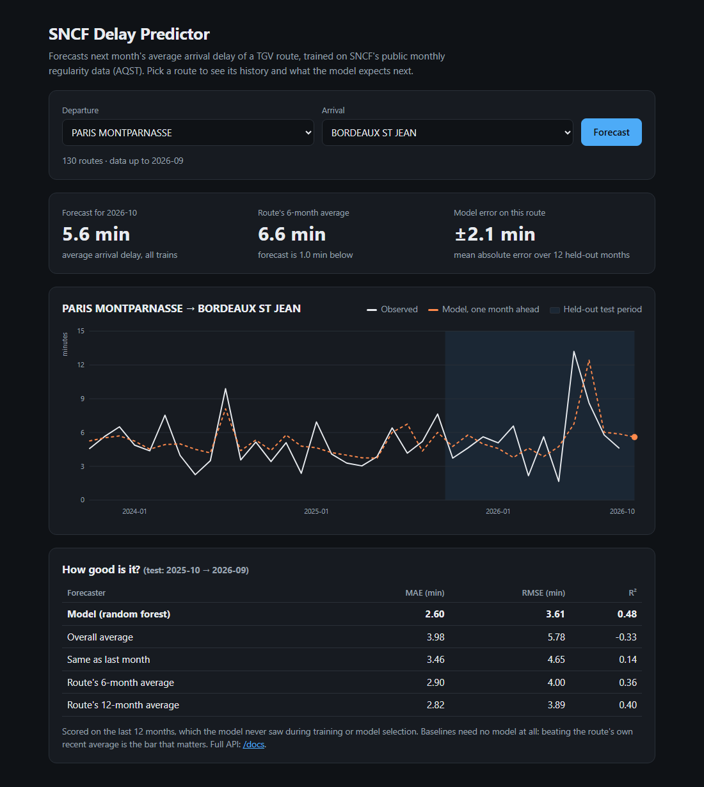
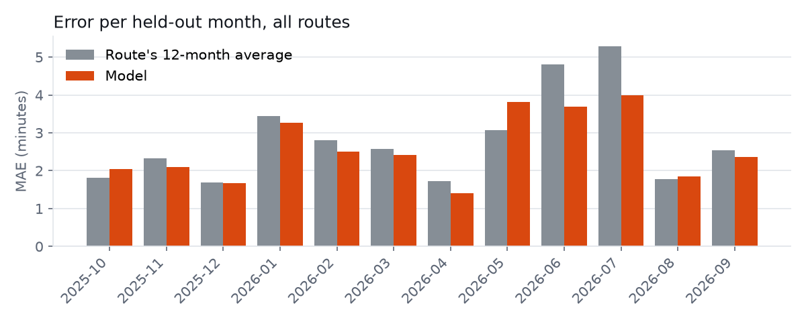
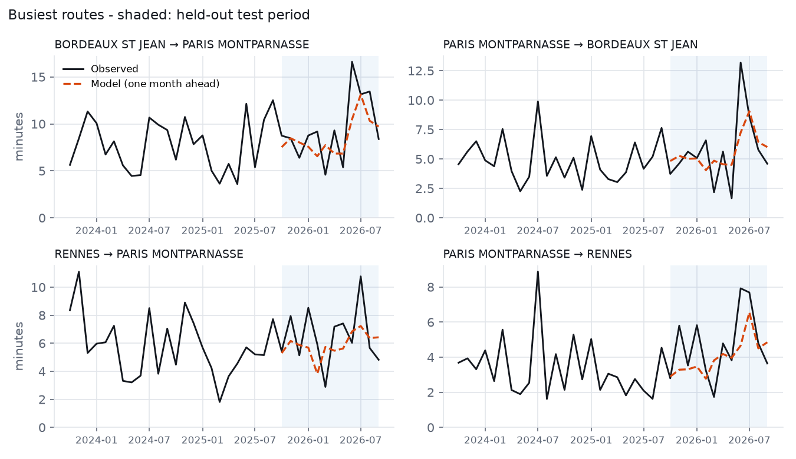

# 🚆 SNCF Delay Predictor

[](https://github.com/ffblan74/sncf-delay-predictor/actions/workflows/ci.yml)


Forecasts **next month's average arrival delay of each TGV route** in France,
from SNCF's public monthly regularity data, the weather at both ends of the
line and the French holiday calendar. End to end: open-data ingestion →
leakage-proof feature engineering → walk-forward model selection → REST API
with a web UI → tests → Docker → CI.



## Why this project

I wanted to apply machine learning to a domain I know from the inside (railway
infrastructure, from my apprenticeship at SNCF Réseau), and to build it the way
production code is built rather than as a notebook: a reusable pipeline, an
honest evaluation against baselines, an API that cannot drift from training,
and tests that pin those properties down.

## The data

[**Régularité mensuelle TGV par liaisons (AQST)**](https://ressources.data.sncf.com/explore/dataset/regularite-mensuelle-tgv-aqst/),
published by SNCF Voyageurs under the Open Database License (ODbL). One row
is one origin-destination pair over one calendar month: **130 routes × 105 months (2018-01 → 2026-09)**,
with planned trains, cancellations, late-train counts, average delays and the
share of each delay cause.

There is no per-train or per-hour information. The honest problem this data
supports is therefore a **panel forecast**: *given everything known up to
month M-1 (plus the timetable and calendar of month M, and a weather scenario
for it), what will a route's average arrival delay be in month M?*

Three outside sources add the context the export lacks (`src/fetch_context.py`):

| Source | What it gives | Used as |
|---|---|---|
| [NASA POWER](https://power.larc.nasa.gov/) daily reanalysis, one point per station | frost days, days ≥ 32 °C, rain, days ≥ 20 mm, snow days, windy days, per station × month | weather of the month at both ends of the route |
| [Open-Meteo](https://open-meteo.com/) forecast API | last 31 days + 16-day forecast | the `forecast` scenario for the month in progress |
| [Calendrier scolaire](https://data.education.gouv.fr/explore/dataset/fr-en-calendrier-scolaire/) (Ministry of Education) | school holidays, zones A/B/C | days on holiday in one / all zones |
| computed (Easter algorithm) | the 11 public holidays | weekday holidays, long weekends, "ponts" |

Sources looked at and *not* used: SNCF's strike dataset (*mouvements sociaux*)
is no longer served by the portal, and the planned-works datasets are per line
section with no mapping to commercial routes. Strikes still reach the model
through last month's network-wide cancellation rate.

Data quirks the pipeline has to handle (all covered by tests):

| Quirk | Handling |
|---|---|
| April 2020: traffic at zero, `duree_moyenne = 0` | rows dropped, panel kept dense so lags still mean "k months ago" |
| A few impossible negative averages (down to −472 min, Dec-2019 strike) | dropped; rounding noise just below 0 clipped |
| Months with a handful of trains (std ≈ 80 min under 10 trains) | dropped below 10 planned trains |
| Since 2025-07 some routes split into *National* + *International* rows | merged: counts summed, averages traffic-weighted |
| Free-text comments with embedded newlines and `;` | parsed safely, then dropped |

## Approach

```
fetch_data.py    ──► data/regularite-mensuelle-tgv-aqst.csv
fetch_context.py ──► data/weather_monthly.csv · weather_outlook.csv · school_holidays.csv
                          │
                          ▼
data_pipeline.py   load → clean → dense OD×month panel → causal features
context.py         + weather scenario and calendar of the month
                          │
                          ▼
train.py           walk-forward CV picks RF vs HGB → evaluation fit → test on last 12 months
                   → refit on every month
                          │
                          ▼
models/            model.joblib · model_eval.joblib · feature_columns.json · metrics.json
                   history.csv.gz · weather / school-holiday context
                          │
                          ▼
api.py             FastAPI: /predict · /history · /routes · /metrics · web UI at /
```

**No leakage by construction.** Every feature is built with a `shift(≥1)`
inside each route, on a panel made dense first, so a row never sees its own
month. Columns only knowable after the month (late-train counts, cause
shares…) can only enter as lags. A test corrupts a month's outcomes and checks
that the month's features don't move.

**Features (54).** The route's own history (lags 1/2/3/12, rolling means
3/6/12), network-wide state (last month's national average, its anomaly vs
the yearly level, the same month a year ago, last month's national
cancellation rate, the departure and arrival stations' last month), the
timetable known in advance (planned trains, scheduled duration, traffic
change), calendar month, the route's recent reliability profile (rates of
cancellations and of trains >15/30 min late, all six cause shares), the
**weather** of the month at both ends of the line, and the **calendar** of the
month (public holidays, long weekends, "ponts", weekend days, school holidays).

**Weather is a scenario, not an input one has.** The model is fitted on the
weather that was observed, but nobody knows next month's weather when
forecasting it. The API therefore asks for a scenario: `forecast` (default for
the coming month: days already observed + Open-Meteo's 16-day forecast +
seasonal normals for the rest), `normal`, `harsh` (90th percentile of the
season) or `observed` (past months only). The headline score below uses
`normal`, computed on the training years only, so it is a genuine forecast.

A network-wide weather average was tried and dropped: it takes a single value
per month, the forest used it to memorise months, and it hurt walk-forward
validation as well as the test.

**Predict the deviation, not the level.** The model learns the gap between the
month's delay and the route's 6-month average. It is robust to the slow drift
of the overall delay level and falls back gracefully to a sane baseline.

**Chronological evaluation only.** The last 12 months are held out. Model
selection (random forest vs histogram gradient boosting) uses three 6-month
walk-forward folds *inside* the training period. Every run also scores the
naive forecasts the model has to beat.

**No train/serve skew.** The API ships with the cleaned history and the
weather / calendar context, and builds the feature row through the *same*
functions used in training. A test asserts that a served prediction equals the
offline one to the last digit.

**Two models, each for its job.** `model_eval.joblib` is fitted before the
test period and answers every past month (backtests, the history chart), so
those forecasts stay out of sample. Once evaluated, the same model is refitted
on *every* month, test year included: `model.joblib` forecasts the coming
month with the most recent data it can learn from.

## Results

Held-out test: **2025-10 → 2026-09**, 1,446 route-months never seen during
training or model selection.

| Forecaster | MAE (min) | RMSE (min) | R² |
|---|---:|---:|---:|
| **Model (random forest), seasonal-normal weather** | **2.60** | **3.62** | **0.48** |
| *Same model, had the month's weather been known* | *2.49* | *3.40* | *0.54* |
| *Same model, no weather or calendar input* | *2.57* | *3.57* | *0.49* |
| Route's 12-month average | 2.82 | 3.89 | 0.40 |
| Route's 6-month average | 2.90 | 4.00 | 0.36 |
| Same as last month | 3.46 | 4.65 | 0.14 |
| Overall average | 3.98 | 5.78 | −0.33 |

**−8% MAE against the best baseline**, and +0.08 R². That gain is modest on
purpose: a route's recent average is a strong predictor of a monthly mean, and
beating it is the bar that matters. Any number without that comparison would
be meaningless.

**What the weather is worth.** Knowing the month's weather cuts the error by a
further 4% (2.49 vs 2.60) and lifts R² from 0.48 to 0.54: heat waves are the
clearest signal (days ≥ 32 °C is the second most important feature). With
seasonal normals only, the weather and calendar inputs add nothing measurable
on the test year (2.60 vs 2.57 without them, within noise; walk-forward
validation slightly favoured keeping them). The value of the context therefore
depends on how much of the month is known when forecasting: the `forecast`
scenario, with up to ~3 weeks of observed and forecast weather, sits between
the two rows above. It cannot be backtested, since past forecasts are not
archived.



The model wins in 9 of the 12 months, by the widest margin in the summer
peak (June-July). It loses in May 2026, when it anticipated the summer
degradation a month early, and narrowly in October 2025, December 2025 and
August 2026.



Most influential features (permutation importance on the test set): calendar
month, days ≥ 32 °C at the route's ends, the route's 6-month average, its
recent share of trains >30 min late, and last month's delays at the departure
station and across the network.

### Limitations

- **Monthly aggregates only.** Without per-train data, the model cannot tell
  *which* train will be late, only how a route's month will look.
- **Weather at the two ends only.** A Paris - Marseille train crosses
  Burgundy and the Rhône valley; storms in between are only seen through the
  network-wide lags. The reanalysis grid (~50 km) also smooths local
  downpours, so "days ≥ 20 mm" is rare in the data.
- **One month ahead.** Forecasting further would require forecasting the lag
  features too; the API refuses beyond the horizon rather than guess.
- **Under-forecast on the test year (bias −1.0 min with normal weather, −0.6
  with the observed one).** 2026 was hotter and worse than the history the
  model learnt from. The served model is now refitted on every month, test
  year included, which is the natural remedy.
- **Feature choices were made with the test set in view.** Dropping the
  network-wide weather was backed by walk-forward validation, but the test
  numbers had been looked at too.
- **Model size was a constraint.** A fully grown forest scored 0.04 min better
  in cross-validation but weighed 13.5 MB against 1.9 MB. The compact one was
  chosen so the trained model can ship with the repository. That choice was
  made after the test numbers had been looked at, which is worth keeping in
  mind when reading the table above.

## Quickstart

The trained model ships in `models/`, so the API runs straight from a clone.

```bash
git clone https://github.com/ffblan74/sncf-delay-predictor.git
cd sncf-delay-predictor
python -m venv .venv && source .venv/bin/activate   # Windows: .venv\Scripts\activate
pip install -r requirements.txt

uvicorn api:app --app-dir src --reload
# → web UI:  http://127.0.0.1:8000
# → API doc: http://127.0.0.1:8000/docs
```

### Retrain on the latest data

SNCF adds a month to the dataset roughly every month:

```bash
python src/fetch_data.py      # downloads the AQST export (~3 MB) into data/
python src/fetch_context.py   # weather (NASA POWER + Open-Meteo outlook), school holidays
python src/train.py           # walk-forward CV, test report, refit, writes models/
python src/make_figures.py    # refreshes docs/*.png (needs requirements-dev.txt)
```

`fetch_context.py` takes about a minute. Re-run it (and `train.py`) close to
serving time: the outlook of the month in progress is only as fresh as its
last download.

### Example request

```bash
curl -X POST http://127.0.0.1:8000/predict \
  -H "Content-Type: application/json" \
  -d '{"gare_depart": "PARIS MONTPARNASSE", "gare_arrivee": "BORDEAUX ST JEAN"}'
```

```json
{
  "gare_depart": "PARIS MONTPARNASSE",
  "gare_arrivee": "BORDEAUX ST JEAN",
  "month": "2026-10",
  "predicted_delay_minutes": 6.2,
  "recent_average_minutes": 6.6,
  "is_backtest": false,
  "actual_delay_minutes": null,
  "history_up_to": "2026-09",
  "weather": "forecast",
  "model": "final",
  "context": {
    "wx_frost_days": 0.0, "wx_hot_days": 0.0, "wx_rain_mm": 32.6,
    "wx_heavy_rain_days": 0.0, "wx_snow_days": 0.0, "wx_windy_days": 0.6,
    "cal_holidays": 0.0, "cal_long_weekends": 0.0, "cal_bridges": 0.0,
    "cal_weekend_days": 9.0, "cal_school_any": 15.0, "cal_school_all": 15.0
  }
}
```

| Endpoint | What it does |
|---|---|
| `GET /` | Web UI: pick a route and a weather scenario, see the conditions used, the history, the model's past forecasts and next month's |
| `POST /predict` | Forecast for a route. Optional: `month` (a past month = backtest with the actual value), `nb_train_prevu` / `duree_moyenne` to override the timetable, `weather` = `forecast` · `normal` · `harsh` · `observed` |
| `GET /history` | A route's observed monthly delays next to the model's one-month-ahead forecasts |
| `GET /routes` | The 130 routes the model can forecast |
| `GET /metrics` | Evaluation report of the served model, with and without the weather / calendar context |
| `GET /health` | Status, model type, last month of data, weather coverage and outlook |

## Docker

```bash
docker build -t sncf-delay-predictor .
docker run -p 8000:8000 sncf-delay-predictor
```

The image runs as a non-root user and exposes a health check.

## Development

```bash
pip install -r requirements-dev.txt
pytest          # 60 tests: pipeline, leakage, context, API, train/serve parity
ruff check src tests
```

The tests and CI never download anything: `src/generate_data.py` produces a
synthetic export with the same schema, separator and data-quality traps as the
real one, plus a matching weather and school-holiday context the synthetic
delays depend on. CI runs lint, the tests, an end-to-end training on synthetic
data, loads the shipped model, then builds the Docker image and checks that
the container answers.

```
src/
  data_pipeline.py   loading, cleaning, panel, features (shared by train and API)
  context.py         weather scenarios and calendar features
  train.py           model selection, evaluation, refit, artifacts
  api.py             FastAPI service
  static/index.html  web UI (no build step, no external dependency)
  fetch_data.py      downloads the real dataset
  fetch_context.py   downloads weather and school holidays
  generate_data.py   synthetic export (and context) for tests and CI
  make_figures.py    README figures, recomputed from the shipped artifacts
tests/               pytest suite
models/              shipped artifacts
```

## Tech stack

Python · pandas · scikit-learn · FastAPI · pytest · ruff · Docker · GitHub Actions

## License

Code: [MIT](LICENSE).

Data: © SNCF Voyageurs, [Open Database License (ODbL)](https://data.sncf.com/pages/cgu/A1#A1).
`models/history.csv.gz` is a cleaned extract of that dataset and is
redistributed under the same licence.

Context shipped in `models/`: weather aggregates derived from
[NASA POWER](https://power.larc.nasa.gov/) (NASA Langley Research Center, public
domain) and [Open-Meteo](https://open-meteo.com/) forecasts (CC BY 4.0);
school holidays from the Ministry of Education's
[open-data portal](https://data.education.gouv.fr/) (Licence Ouverte / Etalab 2.0).
